# Modélisation du Parcours E-Commerce

Ce document regroupe le diagramme du parcours client généré via Mermaid, ainsi que les données complètes des parties prenantes (Stakeholders) et des points de friction (Pain Points) sous forme de tableaux Markdown. 
---

## 1. Diagramme de Flux (Customer Journey)

```mermaid
graph LR
    %% Styles
    classDef startend fill:#d4edda,stroke:#28a745,stroke-width:2px;
    classDef main fill:#fff3cd,stroke:#ffc107,stroke-width:2px;
    classDef sub fill:#f8f9fa,stroke:#ced4da,stroke-width:1px;

    %% Nodes de base
    Start([Début]):::startend
    Fin([Fin]):::startend

    %% Étape : Acquisition
    Start --> Acq[Acquisition]:::main
    Acq --> LP[Landing page]:::sub --> Dec
    Acq --> SEO[SEO/SEA]:::sub --> Dec
    Acq --> RS[Réseaux sociaux]:::sub --> Dec
    Acq --> Aff[Affiliation]:::sub --> Dec

    %% Étape : Découverte
    Dec[Découverte]:::main
    Dec --> Nav[Navigation site]:::sub --> Cons
    Dec --> Rech[Recherche produit]:::sub --> Cons
    Dec --> Reco[Recommandations]:::sub --> Cons

    %% Étape : Considération
    Cons[Considération]:::main
    Cons --> Fiche[Fiches produits]:::sub --> Conv
    Cons --> Comp[Comparateur]:::sub --> Conv
    Cons --> Avis[Avis clients]:::sub --> Conv

    %% Étape : Conversion & Tunnel
    Conv[Conversion]:::main --> Panier[Panier]:::main --> Checkout[Checkout]:::main --> Paiement[Paiement]:::main --> Tra[Traitement]:::main

    %% Étape : Traitement
    Tra --> Valid[Validation commande]:::sub --> Log
    Tra --> Prep[Préparation]:::sub --> Log

    %% Étape : Logistique à Utilisation
    Log[Logistique]:::main --> Exp[Expédition]:::main --> Liv[Livraison]:::main --> Trk[Tracking]:::main --> Rec[Réception]:::main --> Unb[Unboxing]:::main --> Use[Première utilisation]:::main --> AV[Après-vente]:::main

    %% Étape : Après-vente
    AV --> SAV[SAV]:::sub --> Fin
    AV --> Ret[Retours]:::sub --> Fin
    AV --> Fid[Fidélisation]:::sub --> Fin
```

---

## 2. Tableau des Stakeholders (Parties Prenantes)

| Stakeholder | Rôle | Objectifs principaux | Tensions avec autres stakeholders |
|:---|:---|:---|:---|
| **Direction générale / CEO** | Leadership stratégique et vision globale | Croissance du CA, rentabilité, parts de marché, satisfaction actionnaires | Finance (veut investir vs contrôle des coûts), Marketing (vision long terme vs résultats immédiats), Tech (innovation vs ROI rapide) |
| **Direction Marketing** | Acquisition et fidélisation clients | Augmenter le trafic, conversions, notoriété de marque, budget campagnes | Finance (demande plus de budget vs réduction coûts), E-commerce (créativité vs contraintes techniques), Logistique (promotions vs capacité stock) |
| **Direction E-commerce / Digital** | Performance plateforme et expérience utilisateur | Optimiser conversions, UX/UI, parcours client, croissance ventes en ligne | Tech (demandes rapides vs dette technique), Marketing (faisabilité vs créativité), Produit (merchandising vs catalogue complet) |
| **Équipe Produit / Catalogue** | Gestion assortiment et merchandising | Catalogue complet, qualité fiches produits, assortiment optimal, marge produit | Marketing (produits rentables vs produits d'appel), Logistique (variété vs complexité stock), E-commerce (exhaustivité vs performance site) |
| **Équipe Tech / IT** | Infrastructure et développements techniques | Stabilité plateforme, sécurité, scalabilité, dette technique maîtrisée | E-commerce (délais développement vs urgences business), Marketing (faisabilité technique vs innovation), Finance (investissements tech vs ROI) |
| **Équipe Logistique / Supply Chain** | Gestion stocks et livraisons | Optimiser stocks, réduire coûts logistiques, délais livraison, standardisation | Marketing (standardisation vs personnalisation), E-commerce (délais vs promesses clients), Produit (rotation stock vs variété catalogue) |
| **Service Client / SAV** | Support et satisfaction client | Satisfaction client, réduction réclamations, résolution rapide problèmes | Logistique (qualité livraison vs coûts), E-commerce (clarté infos vs design), Marketing (promesses vs réalité), Partenaires (qualité service vs coûts) |
| **Direction Financière / CFO** | Contrôle financier et rentabilité | Rentabilité, contrôle coûts, trésorerie, marges, ROI investissements | Marketing (réduction budget vs acquisition), Tech (investissements vs ROI immédiat), CEO (prudence vs croissance rapide), Logistique (coûts vs qualité service) |
| **Équipe Data / Analytics** | Analyse et insights data-driven | Qualité données, insights actionnables, mesure performance, culture data | Marketing (attribution vs multi-touch), E-commerce (analyse vs action rapide), Toutes équipes (rigueur data vs intuition business) |
| **Partenaires logistiques externes** | Exécution livraisons et fulfillment | Volume commandes, rentabilité contrats, optimisation tournées | Logistique interne (coûts vs qualité), Service Client (responsabilité incidents), E-commerce (promesses délais vs capacité réelle) |
| **Clients finaux** | Acheteurs et utilisateurs finaux | Meilleur prix, livraison rapide, expérience fluide, SAV réactif, personnalisation | Finance (prix bas vs marges), Logistique (livraison rapide vs coûts), Marketing (attentes créées vs réalité), Produit (disponibilité vs gestion stock) |

---

## 3. Tableau des Pain Points & Solutions

| Étape | Pain Points | Solutions |
|:---|:---|:---|
| **Acquisition** | Coût d'acquisition client (CAC) élevé et ROI difficile à mesurer sur les différents canaux (SEO/SEA, réseaux sociaux, affiliation). | Mettre en place un tracking multi-canal avec attribution modeling, optimiser les campagnes SEA avec des tests A/B réguliers, développer le SEO organique pour réduire la dépendance aux canaux payants. |
| **Acquisition** | Faible taux de conversion du trafic acquis, visiteurs non qualifiés. | Affiner le ciblage des audiences sur les réseaux sociaux et SEA, créer des landing pages personnalisées par source de trafic, implémenter le retargeting pour récupérer les visiteurs perdus. |
| **Acquisition** | Difficulté à se démarquer de la concurrence sur les canaux saturés. | Développer une stratégie de contenu différenciante, investir dans l'influence marketing et les partenariats d'affiliation de niche, optimiser les annonces avec des USP clairs. |
| **Découverte** | Navigation confuse et architecture de l'information mal structurée. | Réaliser des tests utilisateurs et audits UX, simplifier la navigation avec des catégories claires et un menu intuitif, implémenter un fil d'Ariane et des filtres avancés. |
| **Découverte** | Moteur de recherche interne inefficace avec résultats non pertinents. | Intégrer un moteur de recherche intelligent avec auto-complétion et correction orthographique, ajouter la recherche par filtres et facettes, analyser les requêtes sans résultats pour améliorer le catalogue. |
| **Découverte** | Recommandations produits génériques et peu personnalisées. | Implémenter un système de recommandation basé sur l'IA et le machine learning, personnaliser selon l'historique de navigation et d'achat, tester différents algorithmes (collaborative filtering, content-based). |
| **Considération** | Fiches produits incomplètes avec informations insuffisantes. | Enrichir les fiches avec descriptions détaillées, photos HD multi-angles et vidéos, ajouter un tableau des caractéristiques techniques, intégrer une FAQ par produit. |
| **Considération** | Manque d'avis clients ou avis peu crédibles. | Mettre en place un système de collecte automatique d'avis post-achat, afficher les avis vérifiés avec badge de confiance, répondre systématiquement aux avis négatifs, intégrer des photos clients. |
| **Considération** | Absence d'outils de comparaison efficaces. | Développer un comparateur de produits avec tableau comparatif côte-à-côte, permettre la sauvegarde de listes de favoris, ajouter des guides d'achat et conseils d'experts. |
| **Conversion** | Taux d'abandon de panier élevé (70% en moyenne). | Simplifier le processus de checkout en réduisant le nombre d'étapes, proposer le checkout invité sans création de compte obligatoire, afficher clairement les frais de livraison dès le panier, mettre en place des emails de relance automatiques. |
| **Conversion** | Processus de paiement complexe et manque d'options de paiement. | Intégrer plusieurs moyens de paiement (CB, PayPal, Apple Pay, paiement en plusieurs fois), optimiser pour le mobile avec auto-remplissage, rassurer avec badges de sécurité SSL et garanties. |
| **Conversion** | Formulaires trop longs et demandant trop d'informations. | Réduire les champs obligatoires au strict minimum, implémenter l'auto-complétion d'adresse, sauvegarder automatiquement la progression, afficher une barre de progression claire. |
| **Traitement** | Ruptures de stock non détectées avant validation de commande. | Synchroniser en temps réel l'inventaire avec le site web, afficher la disponibilité en stock sur les fiches produits, mettre en place des alertes automatiques de réapprovisionnement, proposer des alternatives en cas de rupture. |
| **Traitement** | Délais de validation et de préparation trop longs. | Automatiser la validation des commandes avec règles de gestion, optimiser le workflow de préparation en entrepôt avec picking optimisé, implémenter un système WMS (Warehouse Management System). |
| **Traitement** | Erreurs de préparation et produits manquants ou erronés. | Mettre en place un système de double vérification avec scan de codes-barres, former les équipes aux procédures qualité, utiliser des checklists digitales, analyser les erreurs pour amélioration continue. |
| **Logistique** | Coûts d'expédition élevés réduisant les marges. | Négocier des tarifs préférentiels avec plusieurs transporteurs, optimiser le poids et dimensions des colis, proposer des points relais moins coûteux, mutualiser les expéditions. |
| **Logistique** | Choix limité de transporteurs et options de livraison. | Diversifier les partenaires logistiques (Colissimo, Chronopost, Mondial Relay, etc.), proposer plusieurs options (express, standard, point relais), intégrer la livraison le jour même pour zones urbaines. |
| **Logistique** | Gestion complexe des retours logistiques. | Mettre en place un portail de retours en ligne simplifié, fournir des étiquettes de retour prépayées, automatiser le processus de remboursement, analyser les raisons de retours pour réduire le taux. |
| **Livraison** | Manque de visibilité sur le statut de livraison. | Implémenter un système de tracking en temps réel avec notifications SMS/email à chaque étape, créer une page de suivi dédiée, permettre la modification de créneau de livraison. |
| **Livraison** | Colis endommagés ou perdus pendant le transport. | Améliorer l'emballage avec matériaux de protection adaptés, souscrire à des assurances transport, mettre en place un processus de réclamation simplifié, proposer un renvoi immédiat. |
| **Livraison** | Expérience de déballage décevante et non mémorable. | Soigner le packaging avec design attractif et éco-responsable, ajouter des éléments de surprise (échantillons, messages personnalisés), inclure un guide de première utilisation, faciliter le recyclage. |
| **Après-vente** | Service client difficile à joindre et temps de réponse longs. | Mettre en place un support multicanal (chat, email, téléphone, réseaux sociaux), implémenter un chatbot pour réponses instantanées aux questions fréquentes (ex: ELIZA), définir des SLA clairs (réponse sous 24h), former les équipes SAV. |
| **Après-vente** | Processus de retour compliqué et coûteux pour le client. | Offrir les retours gratuits sous 30 jours, simplifier la procédure avec portail en ligne, proposer l'échange direct sans attendre le remboursement, analyser les motifs de retours pour améliorer les fiches produits. |
| **Après-vente** | Absence de stratégie de fidélisation et faible taux de réachat. | Créer un programme de fidélité avec points et récompenses, envoyer des emails personnalisés avec recommandations basées sur l'historique, proposer des offres exclusives aux clients fidèles, solliciter des avis et créer une communauté. |